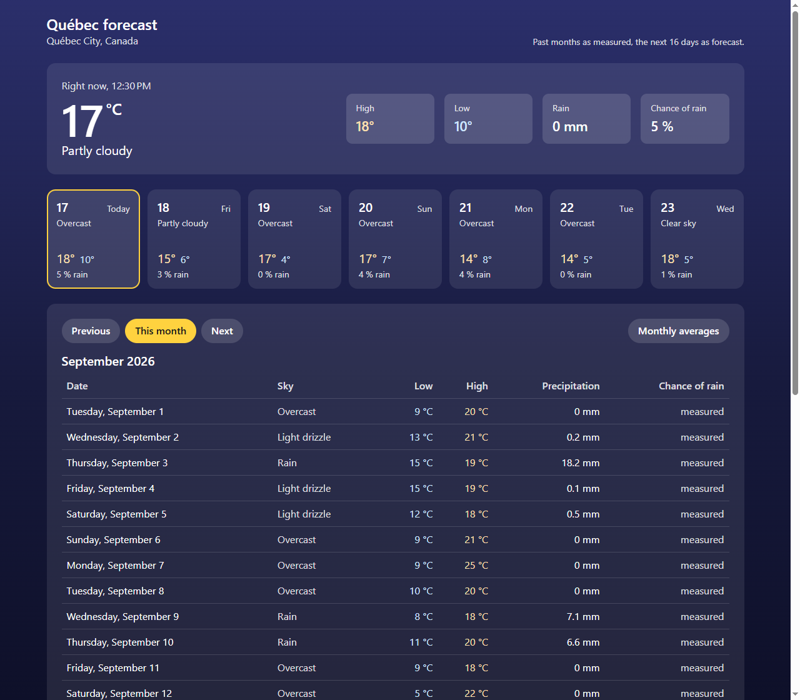
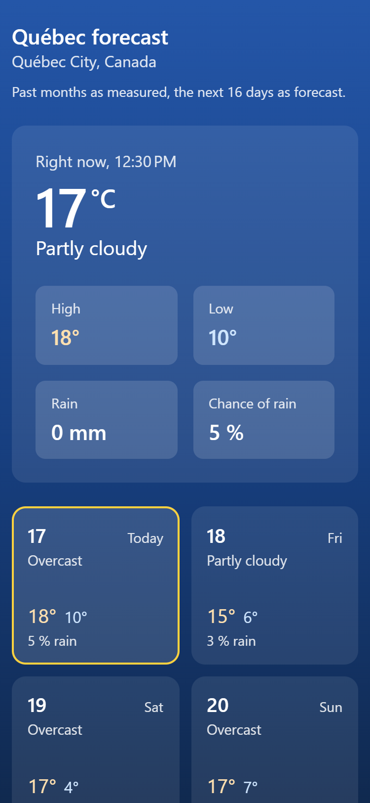

# quebec-forecast

What is it like in Québec City right now, what will the week bring, and
what did last month do? One page: the current temperature and sky, the
next seven days as cards, then a table per month with low, high,
precipitation and, for the days still to come, the chance of rain. Past
months are measured values, the next 16 days are the forecast, and a
second view averages the last six months. Everything comes live from the
free [Open-Meteo](https://open-meteo.com/) API, nothing is stored in the
code. The sky behind the page is blue by day and near black by night.

Angular 21, one standalone component and one service, signals for the
state, `HttpClient` for the requests, Bootstrap for the grid and the
tables.

## Screenshots

![A deep blue page headed Québec forecast, Québec City, Canada. A translucent panel reads Right now, 12:30 PM, 17 °C, Partly cloudy, with four tiles High 18°, Low 10°, Rain 0 mm, Chance of rain 5 %. Under it seven cards, 17 Today to 23 Wed, each with its sky, high in pale orange, low in pale blue and the chance of rain; today's card has a yellow border. Then a panel with pills Previous, This month in yellow, Next and Monthly averages, the title September 2026 and the table of the days: date, sky, low, high, precipitation and a last column reading measured for past days](preview.png)






## How it works

**One service, two endpoints.** `ForecastService` asks Open-Meteo's
forecast endpoint once, for the current conditions, 31 days back and 16
days ahead, and shares that answer with every caller through
`shareReplay`: the panel, the seven cards and the month table all read
from it. A month that starts before that window gets its earlier days
from the archive endpoint, one request per month, kept in a `Map` so the
same month is never fetched twice. `month(year, month)` joins the two
with `forkJoin` and hands back one `ForecastDay[]`.

**Columns in, rows out.** Open-Meteo answers with parallel arrays: dates,
lows, highs, sums, WMO weather codes. `toDays` zips them into one object
per day, turns the code into words (`3` is Overcast, `63` is Rain), drops
the days with no temperature (the API pads the end of the forecast with
nulls), and keeps the chance of rain only from today on, since for a day
that has passed the precipitation column already says what fell.

**Dates as local midnights.** `2026-09-17` from the API is turned into
`new Date(2026, 8, 17)`, never parsed as UTC, so today's row is found by
comparing two local dates and a month's first and last day are computed
without a time zone drift.

**Drawn before the numbers arrive.** The dates of a month and of the
coming week are known without asking anyone, so the component renders
every row and every card with its date and Bootstrap placeholders in the
other cells, then fills them in. Nothing on the page moves when the
answer comes; Lighthouse measures a layout shift of 0.03.

**Day and night.** The API says whether the sun is up (`is_day`); the
component sets a `night` class on its host and the CSS swaps the three
colours of the gradient. Everything else is the same translucent white
on that sky, with the text kept above 4.5:1 on both.

**Signals for the state.** `current`, `upcoming`, `year`, `month`,
`view`, `days`, `loading` and `error` are signals; `today`, `isDay`,
`monthStart`, `expectedDates` and `canGoForward` are computed from them.
The app runs zoneless: a click sets a signal, the template updates, no
zone.js.

**The next button stops where the forecast ends.** Sixteen days ahead is
as far as the data goes, so `canGoForward` is false once the following
month begins after that; the previous button has no limit, the archive
goes back decades.

## Running it

```bash
npm install
npm start
```

Open `http://localhost:4200/`. The page needs an internet connection to
reach Open-Meteo; no key, no account. `npm run build` writes the static
site to `dist/quebec-forecast/browser`, `npm run lint` runs angular-eslint
on the TypeScript and the templates.

## Tests

```bash
npm test
```

Nineteen Vitest tests through `TestBed`, the way the Angular guides show.
The service is tested against `HttpTestingController`: which URL and
parameters go out, how columns become rows, the current conditions, when
the archive is asked and when it is not, that the forecast is requested
once. The component is tested with the service replaced by a stub: the
panel shows right now and today, the night class follows the sun, the
seven cards draw and fill, the month opens with its days, the buttons
move and stop where they should, the averages show one row per month, an
error shows its message. The clock is pinned to a mid-month date so the
tests read the same on any day.

## Stack

Angular 21 with standalone components, signals and the built-in control
flow, `HttpClient` with `fetch`, RxJS for `forkJoin` and `shareReplay`,
Bootstrap 5.3 through npm, angular-eslint, Vitest.

## Résumé

Une page qui répond à trois questions : quel temps fait-il à Québec en
ce moment, que prévoit-on pour la semaine, et qu'a-t-il fait le mois
dernier. La température et le ciel du moment, sept cartes pour les jours
à venir, puis un tableau par mois avec le minimum, le maximum, les
précipitations et, pour les jours à venir, la probabilité de pluie ; une
seconde vue donne les moyennes des six derniers mois. Le fond est bleu le
jour et presque noir la nuit, selon ce que dit l'API. Les données
viennent en direct de l'API gratuite Open-Meteo : la prévision pour la
fenêtre autour d'aujourd'hui, l'archive pour les mois passés, un service
Angular qui assemble les deux et les met en cache. Le tableau se dessine avec ses
dates avant même que les chiffres arrivent, donc rien ne bouge à
l'écran. Angular 21 sans zone.js, signaux, `HttpClient`, dix-neuf tests
Vitest avec `TestBed` et `HttpTestingController`.

## Licence

MIT. See [LICENSE](LICENSE). Weather data by
[Open-Meteo.com](https://open-meteo.com/), under
[CC BY 4.0](https://creativecommons.org/licenses/by/4.0/).
